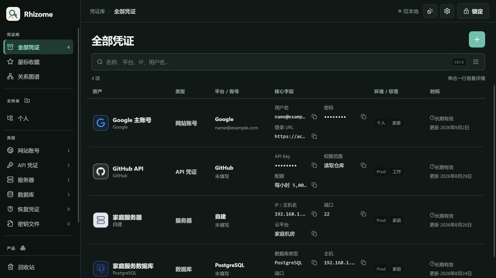
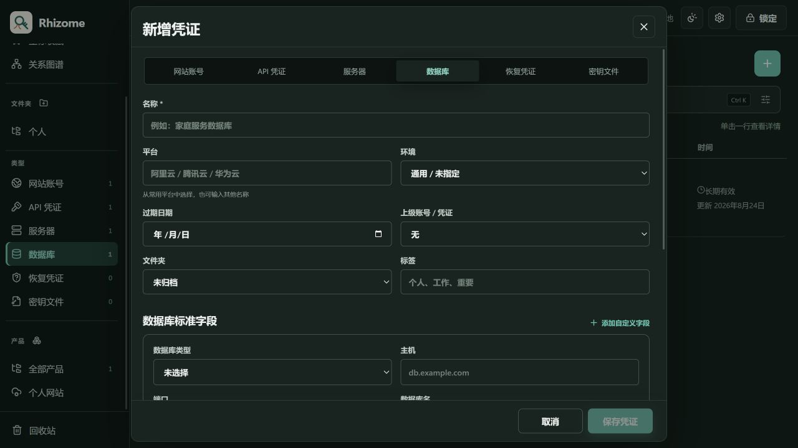
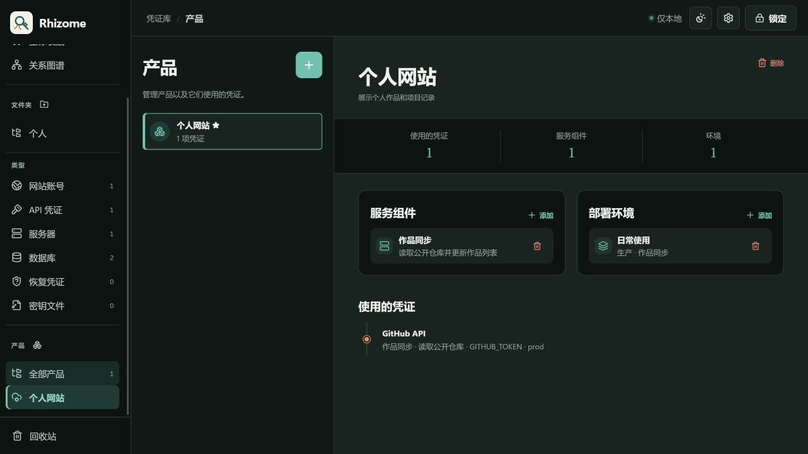
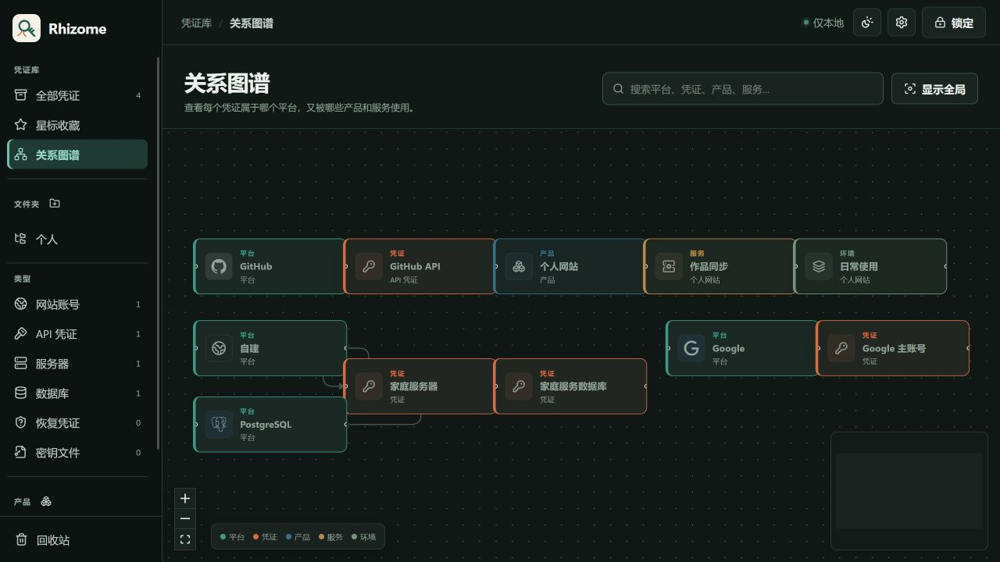
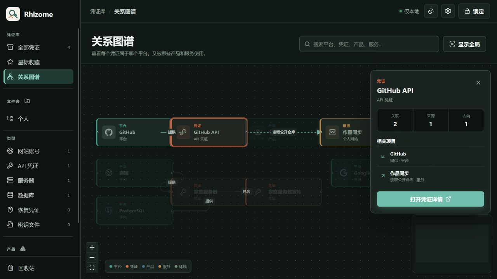
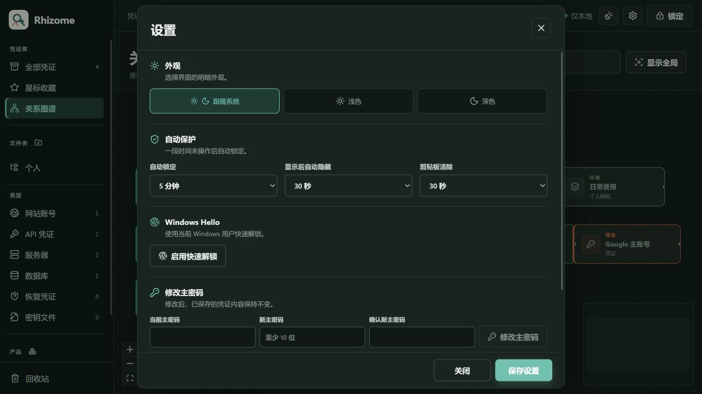

# Rhizome 桌面端产品审查（2026-09-02 至 2026-09-03）

## 结论

本轮状态：**通过，已修复审查中发现的主要可用性问题**。

审查使用 1280 × 720 桌面视口和仅在开发模式启用的本地假数据，不读取或改写真实凭证库。检查范围覆盖凭证列表、新增、编辑、详情、复制、产品、关系图谱、设置、主题、锁定和快速解锁。

## 逐步审查

1. **凭证列表**：六列信息在常见桌面宽度下完整落位，不再默认出现横向滚动条；核心字段继续显示局部内容或遮罩，并保留独立复制按钮。字号、行高和列宽已提高。

   

2. **按类型新增**：从“数据库”分类新增时，类型直接选中数据库；数据库类型和连接方式使用下拉选项；底部“取消/保存凭证”始终可见。

   

3. **新增与编辑**：实际保存了一条演示数据库并自动打开详情；编辑同一条记录时不显示类型切换，避免误改数据结构。该流程同时由组件测试覆盖。

4. **详情与关联**：详情仅在点击列表行后出现，点击遮罩关闭；“使用方/下游使用方”改为“使用位置”，关联入口改为“添加关联”。敏感值仍默认遮罩，复制和限时显示互不混淆。

5. **产品**：产品页改为直接描述“产品用了哪些凭证”，服务、环境和反向查询处于同一视图；示例内容改为个人网站和作品同步，不再用 AI 助手式样例占据主界面。

   

6. **关系图谱**：平台 → 凭证 → 产品 → 服务 → 环境保持从左到右；互不相连的小图被并排打包，减少大面积空白；全局视图缩小留白后，节点在 1280 宽度下可直接阅读。

   

7. **图谱搜索与节点详情**：搜索可定位平台、凭证、产品和服务；选中节点后显示来源、去向和相邻节点，并可打开完整详情。

   

8. **设置与锁定**：设置使用固定页头、独立滚动正文和固定页脚，底部按钮不再被裁切；顶部主题按钮单击即生效。快速解锁启用后，进入锁定页会自动发起一次 Windows Hello，取消后仍可手动重试。

   

## 测试结果

- 前端组件与流程：12 个测试文件、35 项测试通过。
- TypeScript 类型检查：通过。
- 浏览器主路径：新增、编辑、详情、图谱搜索、节点详情、产品、设置、主题、锁定与快速解锁通过。
- 完整质量门禁：格式、代码检查、类型检查、前端测试、Rust 格式与静态检查、Rust 测试、契约检查、数据库迁移检查、Tauri 编译检查和前端生产构建全部通过。
- 原生边界：Windows Hello 系统对话框及标题栏颜色仍需要在 Tauri 窗口内人工验收；浏览器审查已验证自动触发、等待和恢复状态。
